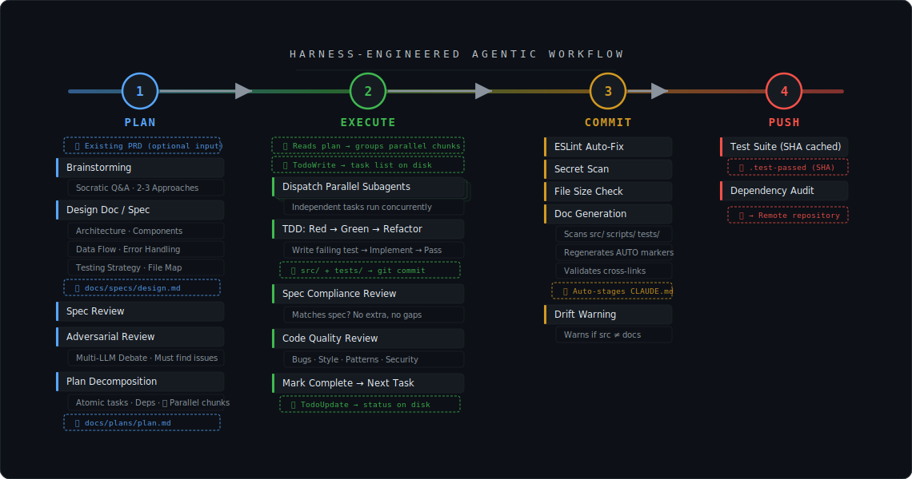

<div align="center">

# Harness Engineering and Best Practices for Coding Agents

**A field guide and Claude Code plugin for long-running AI coding agent harnesses**

[](./LICENSE)
[](https://nodejs.org)
[](https://github.com/jrenaldi79/harness-engineering)
[](https://github.com/jrenaldi79/harness-engineering)
[](https://github.com/jrenaldi79/harness-engineering/commits)
[](https://github.com/jrenaldi79/harness-engineering)

</div>

AI coding agents are stateless with finite context windows. Every tool call, every file read, every thinking block compounds - and eventually the agent loses its original instructions, forgets earlier decisions, and starts producing churn instead of progress. [Andrej Karpathy](https://x.com/karpathy/status/1937902205765607626) called this discipline "context engineering": the art of filling the context window with just the right information at just the right time.

Harness engineering is context engineering applied to coding agents. It's how you structure rule files, plan before building, enforce quality mechanically, and keep documentation in sync with code - so your agent stays aligned across long sessions instead of going off the rails.

This repo is two things:

1. **A field guide** to harness engineering — mapping 20+ best practices from [OpenAI](https://openai.com/index/harness-engineering/), [Augment Code](https://www.augmentcode.com/blog/your-agents-context-is-a-junk-drawer), [Anthropic](https://www.threads.com/@boris_cherny/post/DUMZr4VElyb/), and practitioners like [Andrej Karpathy](https://x.com/karpathy/status/1937902205765607626) (AI researcher, co-founder of OpenAI), [Boris Cherny](https://newsletter.pragmaticengineer.com/p/building-claude-code-with-boris-cherny) (creator of Claude Code), and [Thariq Shihipar](https://x.com/trq212) (Claude Code team at Anthropic) to concrete implementation patterns.

2. **A Claude Code plugin** (`/setup`) that sets up a project through Socratic questioning: `CLAUDE.md` templates, TDD enforcement, git hooks (secret scan, file size limits, auto-generated docs, drift detection), and integrated agentic workflows (BMAD, Superpowers, Sidecar). Supports any language or stack — Node/TypeScript is the recommended default for web projects, but the skill adapts to Python, Go, Rust, C/C++, and more.


<div align="center">

</div>

---

## Table of Contents

- [Agentic Planning & Execution](#agentic-planning--execution)
- [Mapping to Industry Best Practices](#mapping-to-industry-best-practices)
- [Quick Start](#quick-start)
- [What You Get](#what-you-get)
- [How It Works](#how-it-works)
  - [Two-Tier CLAUDE.md System](#two-tier-claudemd-system)
  - [Progressive Disclosure](#progressive-disclosure)
  - [Auto-Generated Sections](#auto-generated-sections)
  - [Git Hook Enforcement](#git-hook-enforcement)
  - [Quality Gates](#quality-gates)
- [Customization](#customization)
- [Design Decisions](#design-decisions)

---

## Agentic Planning & Execution

A well-maintained harness keeps your agent aligned. But **the biggest gains come from how you plan before writing code.** Long-running coding agents need structured planning, adversarial review, and test-driven development to produce reliable results. Don't skip this step.

### Why Planning Matters

Agents that start coding without a plan produce more churn than progress. They make architectural decisions in isolation, create inconsistent patterns, and build features that don't fit together. The fix isn't more rules in CLAUDE.md. It's better planning upfront.

**Do not rely on built-in "plan mode"** in any AI coding tool. These are shallow outlines, not engineering plans. Instead, use agentic planning systems that produce structured specs, decompose work into atomic tasks, and include review gates.

### TDD Is Non-Negotiable

Write failing tests first, implement the minimum to pass, then refactor. Every task follows Red-Green-Refactor. The global CLAUDE.md template enforces this.

### Integrated Development Workflows

These agentic development systems plug directly into your harness. They don't just plan — they enforce a structured workflow from ideation through implementation, code review, and quality gates:

#### For Large Projects: BMAD Method

[BMAD](https://github.com/bmad-code-org/BMAD-METHOD) (Breakthrough Method for Agile AI-Driven Development) is a full-lifecycle framework with 9 specialized agent personas, 34+ workflows, and built-in adversarial review. Install it for projects with significant architectural scope.

```bash
npx bmad-method install
```

| Phase | What Happens | Key Agent |
|---|---|---|
| **Analysis** | Brainstorming, domain research, product brief | Analyst |
| **Planning** | PRD creation, UX design | Product Manager |
| **Solutioning** | Architecture design, epic/story breakdown, readiness check | Architect |
| **Implementation** | Sprint planning, development, code review, QA | Developer, QA |

**The adversarial review is the part worth paying attention to.** BMAD reviewers are mandated to find issues. "Looks good" with zero findings triggers re-analysis. This catches architectural flaws before they become expensive. The reviewer operates with fresh context (no access to the original reasoning), which prevents confirmation bias.

Use `/bmad-help` to see what step comes next. Start fresh chats for each workflow to avoid context window limits.

#### For Feature Development: Superpowers Plugin

[Superpowers](https://github.com/obra/superpowers) is a Claude Code plugin with 16 composable skills that enforce a structured workflow: brainstorm, plan, implement, review.

```
/plugin marketplace add obra/superpowers-marketplace
/plugin install superpowers@superpowers-marketplace
```

**Use `/superpowers:brainstorming` instead of built-in plan mode.** It runs a Socratic design session: asking clarifying questions, exploring 2-3 approaches with tradeoffs, and producing a validated design document before any code is written.

Key skills:

| Skill | What It Does |
|---|---|
| `brainstorming` | Socratic design session with structured output |
| `writing-plans` | Decomposes designs into 2-5 minute atomic tasks with exact file paths and code |
| `subagent-driven-development` | Dispatches a fresh subagent per task with two-stage review (spec compliance + code quality) |
| `dispatching-parallel-agents` | Runs multiple independent subagents concurrently |
| `test-driven-development` | Enforces strict Red-Green-Refactor per task |
| `systematic-debugging` | 4-phase root-cause investigation before any fix |

**The parallel development workflow is the most useful part.** The `writing-plans` skill decomposes a design into atomic tasks (2-5 minutes each) with explicit file paths, dependencies, and execution order. It groups independent tasks into chunks that can run concurrently, while sequencing tasks that depend on each other's output. The `subagent-driven-development` skill then dispatches a fresh subagent per task. Each gets clean context with only the spec it needs, implements with TDD, and goes through two-stage review (spec compliance, then code quality) before the next task begins. The main agent acts as controller, providing context and answering subagent questions without polluting its own context window.

**Prefer this over agent swarms.** Superpowers scopes work into dependency-aware atomic units assigned to individual subagents, each with clean context. Agent teams (swarms) share state and coordinate via messaging, which creates overhead and context pollution. Sequential subagent dispatch with a controller is more reliable: no crosstalk, no merge conflicts, no duplicate work. Each subagent's output is verified before it feeds into the next task.

#### For Multi-LLM Adversarial Review: Claude Sidecar

[Claude Sidecar](https://claudesidecar.ai) spawns parallel conversations with other LLMs (Gemini, GPT, DeepSeek, Grok, 200+ models via OpenRouter) alongside your Claude Code session. Use it to stress-test architecture plans with multiple models before committing to a direction.

```bash
npm install -g claude-sidecar
sidecar start --model gemini-pro --agent plan --prompt "Review this architecture for weaknesses"
```

The sidecar model receives your full Claude Code conversation context automatically. **Plan mode** (read-only) ensures the reviewer can analyze but not modify files. Results fold back into your main session as structured summaries.

This works well for architectural decisions: send the same plan to 2-3 different models simultaneously, get independent critiques, then synthesize the best feedback.

#### For Comprehensive Agent Configuration: Everything Claude Code

[Everything Claude Code](https://github.com/affaan-m/everything-claude-code) is a batteries-included agent harness with 17 specialized agents, 81+ skills, and 43+ slash commands. It includes its own multi-model planning system (`/multi-plan` routes to specialist models, `/multi-execute` coordinates parallel implementation).

```
/plugin marketplace add affaan-m/everything-claude-code
/plugin install everything-claude-code@everything-claude-code
```

Its `/orchestrate` command chains planner, TDD guide, code reviewer, security reviewer, and architect agents. It also has a continuous learning system that extracts patterns from sessions into reusable skills.

### Choosing the Right Tool

| Scenario | Tool | Why |
|---|---|---|
| **Large project, complex architecture** | BMAD | Full lifecycle from analysis through implementation with adversarial review at every gate |
| **Feature work, day-to-day development** | Superpowers | Brainstorm → plan → TDD → subagent execution → code review in one enforced workflow |
| **Stress-testing a design decision** | Claude Sidecar | Multi-LLM debate catches blind spots no single model finds |
| **Full agent harness with everything built in** | Everything Claude Code | One harness that tries to do everything — 17 agents, orchestration, continuous learning |

These workflows sit on top of this bootstrap kit's mechanical enforcement layer. Together they form a complete system: the workflows steer how you develop, the harness enforces quality at every commit.

---

## Mapping to Industry Best Practices

This kit implements the core patterns from leading voices in agent-assisted engineering:

- **OpenAI**: [Harness Engineering](https://openai.com/index/harness-engineering/) (Feb 2026): Built a product with zero manually-written code using Codex. By Ryan Lopopolo.
- **Augment Code**: [Your Agent's Context Is a Junk Drawer](https://www.augmentcode.com/blog/your-agents-context-is-a-junk-drawer) (Feb 2026): Research-backed analysis of why more context makes agents worse. By Sylvain Giuliani.
- **Boris Cherny**: Creator of Claude Code at Anthropic. Tips shared via [Threads](https://www.threads.com/@boris_cherny/post/DUMZr4VElyb/) and [interviews](https://newsletter.pragmaticengineer.com/p/building-claude-code-with-boris-cherny).
- **Thariq Shihipar** ([@trq212](https://x.com/trq212)): Claude Code team at Anthropic. Published lessons on [prompt caching](https://x.com/trq212/status/2024574133011673516), [agent design](https://x.com/trq212/status/2027463795355095314), and [spec-driven development](https://x.com/trq212/status/2005315275026260309).
- **Andrej Karpathy**: AI researcher, former head of AI at Tesla, co-founder of OpenAI. Coined "context engineering" as the [successor to prompt engineering](https://x.com/karpathy/status/1937902205765607626).
- **Birgitta Böckeler**: Principal technologist at Thoughtworks. [Context engineering for coding agents](https://martinfowler.com/articles/exploring-gen-ai/context-engineering-coding-agents.html) on Martin Fowler's site.
- **Simon Willison**: Creator of Datasette, Django co-creator. [Agentic engineering patterns](https://simonwillison.net/guides/agentic-engineering-patterns/) and practical CLAUDE.md guidance.
- **Jesse Vincent**: Creator of [Superpowers](https://github.com/obra/superpowers) plugin for Claude Code. Discovered that [compliance beats comprehension](https://blog.fsck.com/2026/03/09/superpowers-5/) in skill design.
- **DHH**: Creator of Ruby on Rails, co-founder of Basecamp/37signals. [Convention over configuration](https://x.com/dhh/status/2018574874675929544) as the foundation for agent-friendly codebases.

| Best Practice | Sources | What They Found | This Kit's Implementation |
|---|---|---|---|
| **Map, not a manual** | OpenAI, Augment, Boris, Willison | OpenAI: "Give Codex a map, not a 1,000-page manual." Augment: ETH Zurich research shows context files *reduce* task success rates while increasing cost 20%+. Boris: Their CLAUDE.md is ~2.5k tokens. Willison: "As few instructions as possible." | Two-Tier CLAUDE.md system: ~200-300 line global + ~200-500 line project file. Templates enforce conciseness by design. |
| **Index over encyclopedia** | OpenAI, Augment | OpenAI: AGENTS.md should be ~100 lines as a table of contents. Augment: Vercel compressed 40KB of docs into an 8KB index file and got 100% pass rate on build/lint/test. | Docs Map pattern in `project-claude.md` links to `docs/*.md` files. CLAUDE.md stays lean; detail lives in docs. |
| **Progressive disclosure** | OpenAI, Augment, Thariq | OpenAI: Agents start with a small entry point and are taught where to look next. Augment: "Two buckets": only document what the agent can't derive from code itself. Thariq: Let agents discover tools incrementally rather than pre-loading everything. | Three tiers: Tier 1 (CLAUDE.md, every conversation), Tier 2 (`docs/`, on demand), Tier 3 (`docs/plans/`, rarely). |
| **Finite attention budget** | Augment, Karpathy, Anthropic | Karpathy: "Context engineering is the delicate art of filling the context window with just the right information." Augment: Instruction-following degrades as constraint density increases. Anthropic: "All components compete for the same finite resource." | 200-300 line CLAUDE.md target. Templates use `<!-- TIP -->` comments to guide what to include vs. omit. |
| **Failure-backed rules only** | Augment, Willison, DHH | Augment: "Would the agent make a mistake without this? If no, delete it." Willison: Only universally applicable instructions. DHH: Conventions create 20 years of training data, so don't re-explain what agents already know. | Templates include only actionable rules: commands, gotchas, constraints. No generic best practices or restated conventions. |
| **Repository as system of record** | OpenAI, Augment, Thariq | OpenAI: "What Codex can't see doesn't exist." Augment: Don't restate what's in code. Thariq: "The file system is an elegant way of representing state that your agent could read into context." | Templates encode architecture, commands, and gotchas in CLAUDE.md and `docs/`. AUTO markers write generated content to files. |
| **Linters over instructions** | Augment, OpenAI, Böckeler, Vincent | Augment: "Never send an LLM to do a linter's job." Böckeler: "Agents flounder in unconstrained environments. Stricter constraints produce more reliable output." Vincent: "Advisory language tests comprehension; hard gates test compliance." | Pre-commit hooks enforce mechanically: ESLint auto-fix, secret scan, file size check. Rules live in tools, not prose. |
| **Mechanical enforcement** | OpenAI, Boris, Thariq | OpenAI: Custom linters and CI validate docs are up to date. Boris: PostToolUse hooks auto-format every file edit. Thariq: Hooks for deterministic verification: "catch hallucinations or skipped steps." | Pre-commit hooks run 5 checks automatically: lint, secret scan, file size, doc generation, drift warning. |
| **Auto-generated docs** | OpenAI | A "doc-gardening" agent scans for stale documentation and opens fix-up PRs. | `generate-docs.js` auto-regenerates CLAUDE.md sections from source code on every commit via AUTO markers. |
| **Drift detection / self-improvement** | OpenAI, Augment, Boris | OpenAI: Documentation "rots instantly." Boris: "Update your CLAUDE.md so you don't make that mistake again." Claude writes rules for itself, compounding institutional knowledge. | `validate-docs.js` warns when source files change without CLAUDE.md updates. Global template includes self-improvement loop guidance. |
| **Enforce invariants, not implementations** | OpenAI, Augment, DHH | OpenAI: "Set boundaries, allow autonomy locally." DHH: "Convention over configuration." Agents predict conventional code extremely well. Augment: Don't restate conventions your linter already enforces. | File size limits (300 lines), complexity red flags, and configurable `CONFIG` objects. Rules are strict; how you meet them is flexible. |
| **Verification feedback loops** | Boris, Thariq, Karpathy | Boris: "Give Claude a way to verify its work" for 2-3x quality improvement." Thariq's agent loop: Gather Context → Take Action → Verify Work. Karpathy: "Give it success criteria and watch it go." | Global template enforces TDD (Red-Green-Refactor). Pre-push hook blocks on test failure. Pre-commit runs lint + secret scan. |
| **Spec-driven development** | Thariq, Boris | Thariq: Have Claude interview you with 40+ questions to build a comprehensive spec before coding. Execute in a separate session. Boris: "Start in Plan mode, iterate until satisfied, then auto-accept." | Referenced in Planning Tools section. BMAD's analysis phase and Superpowers brainstorming implement this pattern. |
| **Parallel sessions via worktrees** | Boris | "The single biggest productivity unlock, and the top tip from the team." Run 3-5+ Claude sessions simultaneously with separate git worktrees. | Referenced in Planning Tools section. Superpowers `using-git-worktrees` skill automates this. |
| **Design for prompt caching** | Thariq | "You fundamentally have to design agents for prompt caching first." Static content first, dynamic last. Never switch models mid-conversation; use subagents instead. | Two-tier CLAUDE.md is inherently cache-friendly: static global + static project files loaded once at conversation start. |
| **Codify repetitive workflows** | Boris, Thariq | Boris: "Convert anything done more than once daily into a slash command." Check into git for team sharing. Include inline bash preprocessing to pre-compute context. | Bootstrap creates `scripts/` directory with 5 enforcement scripts. Templates encourage building project-specific commands and skills. |
| **Subagent dispatch over swarms** | Boris, Vincent | Boris: Use subagents to keep main context clean by offloading subtasks to preserve focus. Vincent: Decompose plans into dependency-aware atomic units; dispatch one subagent per task with two-stage review. Sequential dispatch with a controller avoids crosstalk and merge conflicts. | Referenced in Planning Tools section. Superpowers `subagent-driven-development` and `dispatching-parallel-agents` implement this. |
| **Golden principles** | OpenAI | Opinionated rules encoded in the repo, with background tasks that scan for deviations and open refactoring PRs. | Global CLAUDE.md template encodes universal standards (TDD, naming, security). Enforcement scripts catch deviations on every commit. |
| **Structured architecture** | OpenAI | Rigid layered domain architecture with validated dependency directions, enforced by custom linters and structural tests. | Bootstrap creates `src/`, `tests/`, `scripts/`, `docs/` structure. Templates guide modular design with file and function size constraints. |
| **Smart CI / test caching** | OpenAI | "Corrections are cheap, and waiting is expensive." Minimize blocking gates, maximize throughput. | SHA-based test caching in pre-push hook. Tests only re-run when code changes, not on every push. |
| **Secret detection** | OpenAI | Security as a mechanical constraint, not a discipline problem. | `check-secrets.js` pattern-matches for API keys, tokens, and private keys. Blocks commits automatically. |

**What this kit doesn't cover** (advanced patterns from these sources): Chrome DevTools integration for UI testing, local observability stacks (logs/metrics/traces), agent-to-agent code review, git worktree isolation per change, execution plans as first-class CI artifacts, automated context engines that derive patterns from code without configuration, and prompt-based stop hooks for long-running autonomous tasks. These are enterprise-scale patterns that build on top of the foundation this kit provides.

---

## Quick Start

**Prerequisites:** [Claude Code](https://claude.ai/code) with plugin support, [Git](https://git-scm.com/), and [Node.js](https://nodejs.org/) (v18+) for Node/TypeScript projects.

### 1. Install the plugin

```
# Install the plugin from GitHub
/plugin install jrenaldi79/harness-engineering
```

### 2. Set up your project

```
/setup
```

The `/setup` skill walks you through Socratic questions to determine your stack (language, framework, testing approach, deployment target), then scaffolds and configures the project. It works with any language — Node/TypeScript is the recommended default for web projects, but the skill adapts to Python, Go, Rust, C/C++, and more.

What happens during setup:

| Step | What Happens |
|------|-------------|
| Discovery | Socratic questions determine your stack, language, and project goals |
| Init | Creates project structure and initializes git |
| Dependencies | Installs tooling appropriate for your stack |
| Scripts | Copies enforcement scripts into `scripts/` |
| Hooks | Sets up pre-commit and pre-push git hooks |
| Configs | Copies linter, formatter, and environment configs |
| CLAUDE.md | Generates tailored `CLAUDE.md` files for global and project scope |

Works on **macOS, Linux, and Windows**.

### 3. Start building

```bash
git add -A && git commit -m "Initial project setup"
```

The pre-commit hook runs automatically. If everything passes, your harness is active.

---

## What You Get

```
harness-engineering/
├── .claude-plugin/
│   └── plugin.json               # Plugin manifest
├── skills/setup/
│   ├── SKILL.md                  # Main orchestrator — runs on /setup
│   ├── scripts/
│   │   ├── init-project.js       # Node/TS project scaffolding
│   │   ├── install-enforcement.js # Copies enforcement tooling into target project
│   │   ├── generate-claude-md.js # Generates tailored CLAUDE.md files
│   │   ├── lib/
│   │   │   ├── check-secrets.js      # Blocks commits containing API keys or tokens
│   │   │   ├── check-file-sizes.js   # Blocks files over 300 lines
│   │   │   ├── validate-docs.js      # Warns when CLAUDE.md drifts from code
│   │   │   ├── generate-docs.js      # Auto-regenerates CLAUDE.md sections from source
│   │   │   └── generate-docs-helpers.js
│   │   └── hooks/
│   │       ├── pre-commit            # Runs all checks on every commit (<2s)
│   │       └── pre-push              # Runs test suite before push (with smart caching)
│   ├── templates/
│   │   ├── global-claude.md          # Cross-project standards (TDD, quality, conventions)
│   │   ├── project-claude.md         # Per-project guidance (architecture, commands, gotchas)
│   │   ├── eslint-base.js            # Baseline ESLint rules
│   │   ├── lint-staged.config.js     # Auto-fix on staged files
│   │   ├── .prettierrc               # Code formatting
│   │   ├── .gitignore                # Standard gitignore
│   │   └── .env.example              # Environment variable placeholder
│   └── references/                   # Stack patterns, enforcement docs, CLAUDE.md guide
├── tests/                            # Tests for plugin development
└── README.md                         # You are here
```

---

## How It Works

### Two-Tier CLAUDE.md System

Claude Code reads `CLAUDE.md` files at two levels. The global file sets universal standards. The project file provides project-specific context.

| | Global CLAUDE.md | Project CLAUDE.md |
|---|---|---|
| **Location** | Parent directory (e.g., `~/projects/CLAUDE.md`) | Project root (e.g., `~/projects/my-app/CLAUDE.md`) |
| **Purpose** | TDD, code quality, naming, security | Architecture, commands, modules, gotchas |
| **Size** | ~200-300 lines | ~200-500 lines |
| **Changes** | Rarely | With the code (auto-generated sections update on commit) |

**Precedence:** Project-specific files override global guidance when there are conflicts.

#### What Belongs Where

**Global** (shared across projects): TDD enforcement, operating principles, file size limits, naming conventions, security checklists.

**Project** (specific to one codebase): Architecture diagrams, essential commands, directory structure, module index, critical gotchas, docs map.

---

### Progressive Disclosure

Not everything belongs in `CLAUDE.md`. The agent reads the full file on every conversation, so bloat costs tokens and dilutes signal. Use three tiers:

| Tier | What | Where | When Loaded |
|------|------|-------|-------------|
| **1** | Architecture, commands, quality rules, gotchas | `CLAUDE.md` | Every conversation |
| **2** | Detailed topic documentation | `docs/*.md` | On demand, via Docs Map links |
| **3** | Design documents, plans, decision records | `docs/plans/` | Rarely, when exploring history |

**Rule of thumb:**

| Keep in CLAUDE.md | Move to docs/ |
|---|---|
| Agent needs it for every task | Only needed for specific domains |
| Changes with code structure | Stable reference material |
| Under 20 lines per topic | Over 20 lines of detail |
| Commands, rules, constraints | Tutorials, explanations, history |

The **Docs Map** pattern in `CLAUDE.md` links to topic docs so agents can find detail when they need it:

```markdown
## Docs Map

| Topic | File |
|-------|------|
| Testing strategy and patterns | [docs/testing.md](docs/testing.md) |
| Configuration and env vars | [docs/configuration.md](docs/configuration.md) |
```

---

### Auto-Generated Sections

Sections of `CLAUDE.md` can regenerate automatically from your source code, so you don't have to manually keep code and docs in sync.

#### How It Works

Add marker pairs to your `CLAUDE.md`:

```markdown
<!-- AUTO:tree -->
...this content regenerates automatically...
<!-- /AUTO:tree -->
```

The `generate-docs.js` script scans your source directories and replaces content between markers with fresh data.

| Marker | What It Generates | Source |
|--------|------------------|--------|
| `tree` | ASCII directory structure with JSDoc annotations | Walks `src/`, `scripts/`, `tests/` |
| `modules` | Module table with purpose and key exports from source files | Extracts JSDoc + `module.exports` from source files |

#### Two Modes

```bash
node scripts/generate-docs.js          # Write mode: regenerate + auto-stage
node scripts/generate-docs.js --check  # Check mode: validate only (for CI)
```

Write mode runs automatically in the pre-commit hook. Check mode exits with code 1 if sections are stale, which is useful for CI pipelines.

The script also validates that all markdown cross-links in `CLAUDE.md` point to files that actually exist.

#### Extending

To add a new auto-generated section:

1. Add markers: `<!-- AUTO:yourname -->` ... `<!-- /AUTO:yourname -->`
2. Write a builder function that returns the content as a string
3. Add the marker name to the `generated` map in `generate-docs.js`

---

### Git Hook Enforcement

Hooks are the mechanical enforcement layer. They run automatically and block commits or pushes that violate quality standards, so enforcement doesn't depend on developer discipline.

#### Pre-Commit (runs on every commit, <2s)

| Step | What It Does | Blocks? |
|------|-------------|---------|
| **1. lint-staged** | Runs ESLint with auto-fix on staged files | Yes, if unfixable errors |
| **2. Secret scan** | Pattern-matches for API keys, tokens, private keys | Yes, if secrets found |
| **3. File size check** | Rejects files over 300 lines | Yes, if oversized |
| **4. Doc generation** | Regenerates AUTO markers, auto-stages `CLAUDE.md` | No |
| **5. Drift warning** | Warns if source files changed without `CLAUDE.md` update | No |

#### Pre-Push (runs on every push)

| Step | What It Does | Blocks? |
|------|-------------|---------|
| **1. Test suite** | Runs `npm run test:all` (skipped if cached) | Yes, if tests fail |
| **2. Audit** | Checks `npm audit` for vulnerabilities | No (warning only) |

#### Smart Test Caching

The pre-push hook uses SHA-based caching to avoid re-running tests unnecessarily:

1. `npm test` passes &rarr; `posttest` script writes `HEAD` SHA to `.test-passed`
2. You commit &rarr; SHA changes, cache invalidated
3. You push &rarr; hook compares SHAs. Match? Skip. Mismatch? Run tests.

Each developer has their own local cache (`.test-passed` is gitignored).

---

### Quality Gates

#### File Size Limits

Enforced mechanically by the pre-commit hook.

| Entity | Max Lines | Why |
|--------|-----------|-----|
| **Any file** | 300 | Forces modular design. Large files are hard for agents and humans to reason about. |
| **Any function** | 50 | Prevents monolithic functions. Each function should do one thing. |

#### Complexity Red Flags

Stop and refactor when you see:

| Pattern | Action |
|---------|--------|
| >5 nested if/else | Extract conditions to named functions |
| >3 try/catch in one function | Split error handling into separate concerns |
| >10 imports | Module is doing too much; split it |
| Duplicate logic | Extract to shared utilities |

---

## Customization

Every enforcement script has a `CONFIG` object at the top. Edit patterns, limits, and paths without touching the logic.

| Script | What to Customize |
|--------|------------------|
| `check-secrets.js` | `CONFIG.patterns` (secret regexes), `CONFIG.allowlistPaths` (excluded files) |
| `check-file-sizes.js` | `CONFIG.maxLines` (default: 300), `CONFIG.include`/`CONFIG.exclude` (file globs) |
| `validate-docs.js` | `CONFIG.docFile`, `CONFIG.trackedDirs`, `CONFIG.mappings` |
| `generate-docs.js` | `TREE_DIRS` (directories to scan), `SKIP_DIRS` in helpers (directories to exclude) |

The templates use `<!-- TIP: ... -->` HTML comments that are invisible when rendered but visible when editing. They guide you through customization without cluttering the final document.

See the scripts in `skills/setup/scripts/lib/` for full details on each enforcement script, and `skills/setup/scripts/hooks/` for the git hook implementations.

---

## Design Decisions

**Cross-platform setup.** The scaffolding scripts are written in Node.js, not bash. They work on macOS, Linux, and Windows without requiring WSL or Git Bash.

**Configurable, not hardcoded.** Every enforcement script uses a `CONFIG` object at the top. Customize patterns, limits, and paths without understanding the implementation.

**HTML comment instructions.** The `<!-- TIP: ... -->` comments in templates are invisible in rendered markdown but visible when editing. Templates serve as both documentation and fill-in-the-blank forms.

**200-300 line target.** CLAUDE.md should be small enough that agents process the full content without losing signal in noise. Detailed docs go in `docs/` and are loaded on demand.

**Auto-generation over manual sync.** The `generate-docs.js` script eliminates the most common source of harness drift: developers changing code without updating docs. The pre-commit hook regenerates automatically.

**SHA-based test caching.** Running the full test suite on every push is wasteful if you just ran tests. The cache is per-developer, automatically invalidated by new commits, and zero-config.

---

## License

MIT
